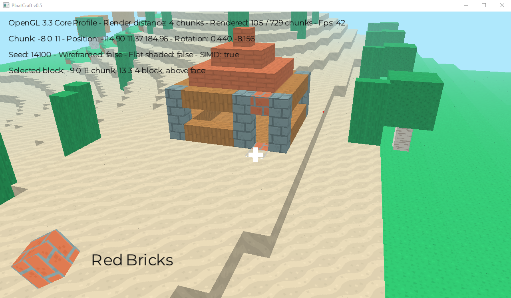

# PlaatCraft
A modern OpenGL Minecraft like game

## Screenshot


## Dependencies
- GLFW3 (extern)
- SQLite3 (extern)
- Glad OpenGL loader (included)
- stb_image (included)
- stb_truetype (included)
- Tiny C Thread (included)

## Build instructions

### Linux (Ubuntu)

1. Install dependencies:
   ```
   sudo apt install build-essential cmake libglfw3-dev libsqlite3-dev
   ```

2. Generate MakeFile via CMake:
   ```
   cd desktop && mkdir build && cd build && cmake ..
   ```

3. Build the project:
   ```
   make -j$(nproc)
   ```

### macOS

1. Install dependencies:
   ```
   brew install cmake glfw sqlite
   ```

2. Generate MakeFile via CMake:
   ```
   cd desktop && mkdir build && cd build && cmake ..
   ```

3. Build the project:
   ```
   make -j$(sysctl -n hw.ncpu)
   ```

### Windows

1. Install [MSYS2](https://www.msys2.org/)

2. Install dependencies:
   ```
   pacman -S mingw-w64-x86_64-toolchain mingw-w64-x86_64-cmake mingw-w64-x86_64-glfw mingw-w64-x86_64-sqlite3
   ```

3. Generate MakeFile via CMake:
   ```
   cd desktop && mkdir build && cd build && cmake -G "MinGW Makefiles" ..
   ```

4. Build the project:
   ```
   mingw32-make -j$(nproc)
   ```
